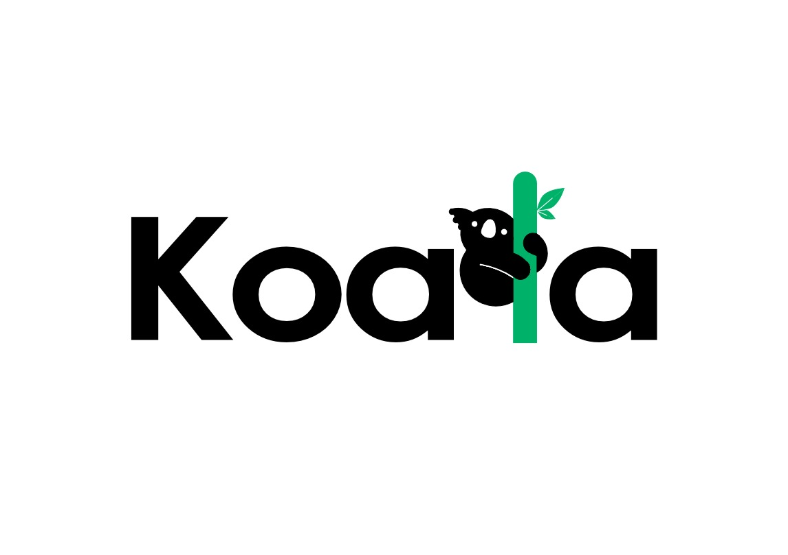

<div align="center">
  

  # Koala.AI
  [](https://www.python.org/downloads/)
  [](https://github.com/psf/black)
  [](http://mypy-lang.org/)
  [](https://github.com/astral-sh/ruff)
</div>

## 🎥 Implementation Demo

<div align="center">
  
[](https://www.youtube.com/watch?v=QmH2iwbtwkc)

**[▶️ Watch the Full Implementation Walkthrough](https://www.youtube.com/watch?v=QmH2iwbtwkc)**

*Complete demo video showing Koala in action*

</div>

---

## 📖 Table of Contents

- [What is Koala?](#-what-is-koala)
- [Features](#-features)
- [Quick Start](#-quick-start)
- [Installation](#-installation)
- [Configuration](#️-configuration)
- [Docker Setup (Airflow)](#-docker-setup-airflow)
- [Usage Examples](#-usage-examples)
- [Architecture](#️-architecture)
- [Development](#-development)
- [Documentation](#-documentation)

---

## 🚀 What is Koala?

Koala is a **Python framework** for building and orchestrating AI agent workflows. Think of it as a lightweight alternative to LangGraph or CrewAI with built-in Apache Airflow integration for production deployment.

### Why Koala?

- ✅ **Simple**: Define workflows in pure Python with minimal boilerplate
- ✅ **Flexible**: DAG or state machine patterns, sync or async execution
- ✅ **Production-Ready**: Built-in Airflow integration for distributed execution
- ✅ **Observable**: Structured logging, metrics, and distributed tracing out of the box
- ✅ **Type-Safe**: Full type hints and mypy-checked
- ✅ **Modular**: Tool registry for reusable components

---

## ✨ Features

### 🔄 Flow Orchestration
- **DAGs (Directed Acyclic Graphs)**: Define dependencies between steps
- **State Machines**: Event-driven workflows with transitions
- **Dynamic Arguments**: Reference previous step results with `$result.step_name`

### 🔧 Tool Registry
- **@tool Decorator**: Automatic registration of reusable functions
- **Type Safety**: Full type hints for tools
- **Introspection**: Automatic discovery of tool capabilities

### 🛡️ Guardrails
- **Pre/Post Guards**: Validate inputs and outputs
- **Safety Checks**: Prevent unsafe operations
- **Custom Validators**: Write your own guard logic

### 📈 Observability
- **Structured Logging**: JSON-formatted logs with context
- **Distributed Tracing**: Track execution across services

### ⚡ Multiple Executors
- **LocalExecutor**: Thread-based, fast startup (development)
- **ProcessExecutor**: Multi-process parallel execution
- **AirflowExecutor**: Distributed, scalable (production)

### 🔌 Integrations
- **Apache Airflow**: Auto-generate DAGs from flows
- **FastAPI**: REST API for flow submission
- **LLMs**: OpenAI-compatible client (OpenAI, Groq, Azure, local models)

---

## 🚀 Quick Start

### Prerequisites

- **Python 3.12+** installed
- **Docker & Docker Compose** (for Airflow deployment)
- **LLM API Key** (OpenAI, Groq, or compatible provider)

### 1. Clone & Setup

```bash
# Clone the repository
git clone https://github.com/koala-ai-agents/Koala.AI
cd koala

# Create virtual environment
python -m venv venv
source venv/bin/activate  # On Windows: venv\Scripts\activate

# Install dependencies
pip install -e ".[dev]"
```

### 2. Configure Environment

```bash
# Copy environment template
cp .example.env .env

# Edit .env and add your LLM API key
# nano .env  # or use any text editor
```

**Minimum required configuration in `.env`:**
```bash
LLM_API_KEY=your-api-key-here
LLM_BASE_URL=https://api.openai.com/v1  # or https://api.groq.com/openai/v1
LLM_MODEL=gpt-4o-mini  # or llama3-8b-8192 for Groq
```

### 3. Run Your First Workflow

```python
# examples/simple_workflow.py
from koala.flow import dag, LocalExecutor
from koala.tools import tool, default_registry

# Define tools
@tool("add")
def add(x: int, y: int) -> int:
    """Add two numbers."""
    return x + y

@tool("multiply")
def multiply(x: int, factor: int) -> int:
    """Multiply by a factor."""
    return x * factor

# Build workflow
flow = (
    dag("math-workflow")
    .step("add_numbers", "add", x=10, y=5)
    .step("multiply_result", "multiply", x="$result.add_numbers", factor=2)
    .build()
)

# Execute
executor = LocalExecutor()
registry = {name: meta.func for name, meta in default_registry._tools.items()}
results = executor.run_dagflow(flow, registry)

print(results)  # {'add_numbers': 15, 'multiply_result': 30}
```

**Run it:**
```bash
python examples/simple_workflow.py
```

---

## 📦 Installation

### Basic Installation

```bash
pip install -e .
```

### With Airflow Support

```bash
pip install -e ".[airflow]"
```

### Development Installation

Includes testing tools (pytest, ruff, black, mypy):
```bash
pip install -e ".[dev]"
```

### Manual Installation (All Dependencies)

```bash
# Install base dependencies
pip install -r requirements.txt

# For development
pip install pytest pytest-cov ruff black isort mypy pre-commit
```

---

## ⚙️ Configuration

Koala uses environment variables for configuration. All settings are defined in a `.env` file.

### Step 1: Create `.env` File

```bash
cp .env.example .env
```

### Step 2: Configure Required Settings

#### 🤖 LLM Configuration (Required for AI features)

```bash
# Your API key from OpenAI, Groq, Azure, etc.
LLM_API_KEY=sk-your-api-key-here

# Base URL (optional - defaults to OpenAI)
LLM_BASE_URL=https://api.openai.com/v1

# Model (optional - auto-detected)
LLM_MODEL=gpt-4o-mini
```

**Supported Providers:**

| Provider | Base URL | Example Model |
|----------|----------|---------------|
| OpenAI | `https://api.openai.com/v1` | `gpt-4o-mini`, `gpt-4o` |
| Groq | `https://api.groq.com/openai/v1` | `llama3-8b-8192` |
| Azure | `https://your-resource.openai.azure.com/openai/deployments/your-deployment` | `your-deployment-name` |
| Local (LM Studio) | `http://localhost:1234/v1` | `local-model` |
| Ollama (with OpenAI compat) | `http://localhost:11434/v1` | `llama3:8b` |

#### 🐘 Airflow Configuration (Required for Docker deployment)

```bash
# Airflow version
AIRFLOW_IMAGE_NAME=apache/airflow:3.1.5

# User ID (Linux/WSL: run `id -u`, Windows: use 50000)
AIRFLOW_UID=50000

# Web UI credentials
_AIRFLOW_WWW_USER_USERNAME=airflow
_AIRFLOW_WWW_USER_PASSWORD=airflow
```

### Step 3: Optional Settings

See `.env.example` for complete list of optional configurations:
- Database connections
- API authentication
- Observability settings
- State management

---

## 🐳 Docker Setup (Airflow)

### Prerequisites

- Docker Desktop or Docker Engine installed
- Docker Compose v2+

### Step 1: Configure Environment

Ensure your `.env` file is configured (see [Configuration](#️-configuration) section).

### Step 2: Start Airflow Services

```bash
# Initialize Airflow database (first time only)
docker-compose up airflow-init

# Start all services
docker-compose up -d
```

**Services started:**
- `airflow-webserver` - Web UI (http://localhost:8080)
- `airflow-scheduler` - Task scheduler
- `airflow-worker` - Celery worker(s)
- `airflow-apiserver` - Execution API
- `airflow-triggerer` - Async triggers
- `postgres` - Database

### Step 3: Access Airflow UI

1. Open browser: http://localhost:8080
2. Login with credentials from `.env`:
   - Username: `airflow` (default)
   - Password: `airflow` (default)

### Step 4: Deploy a Workflow

```python
# cookbook/web_search_agent_airflow.py
from koala.executors.airflow_executor import AirflowExecutor
from koala.flow import dag
from koala.tools import default_registry

# Create executor
executor = AirflowExecutor(
    airflow_url="http://localhost:8080",
    dags_folder="./dags"  # Auto-mounted in Docker
)

# Build workflow
flow = dag("web-search-agent")
    .step("search", "web_search", query="<<FROM_DAG_CONFIG>>")
    .step("summarize", "llm_summarize", content="$result.search")
    .build()

# Generate DAG file (creates ./dags/koala_web-search-agent.py)
registry = {name: meta.func for name, meta in default_registry._tools.items()}
executor.generate_airflow_dag(flow, registry)

print("DAG generated! Check Airflow UI in ~30 seconds")
```

**Run the generator:**
```bash
python cookbook/web_search_agent_airflow.py
```

**Trigger the DAG:**
- Via UI: Click "web-search-agent" → Trigger DAG → Add config `{"question": "what is AI?"}`
- Via CLI: `docker-compose exec airflow-webserver airflow dags trigger web-search-agent --conf '{"question": "what is AI?"}'`

### Docker Management

```bash
# View logs
docker-compose logs -f airflow-scheduler

# Stop services
docker-compose down

# Stop and remove volumes (clean slate)
docker-compose down -v

# Restart specific service
docker-compose restart airflow-scheduler

# Check service health
docker-compose ps
```

### Troubleshooting

#### Issue: "Permission denied" on Linux/WSL

**Fix:** Set correct AIRFLOW_UID in `.env`
```bash
# Get your user ID
id -u
# Add to .env
echo "AIRFLOW_UID=$(id -u)" >> .env
```

#### Issue: DAG not appearing in UI

**Fix:** Wait 30 seconds for scheduler to scan, or check logs:
```bash
docker-compose logs airflow-scheduler | grep -i error
```

#### Issue: Import errors in DAG

**Fix:** Ensure tools are installed in container. Add to `.env`:
```bash
_PIP_ADDITIONAL_REQUIREMENTS=duckduckgo-search beautifulsoup4 requests
```

Or build custom image (recommended for production):
```dockerfile
# Dockerfile.custom
FROM apache/airflow:3.1.5
COPY requirements.txt .
RUN pip install -r requirements.txt
```

---

## 💡 Usage Examples

### Example 1: Simple Math Workflow

```python
from koala.flow import dag, LocalExecutor
from koala.tools import tool, default_registry

@tool("add")
def add(a: int, b: int) -> int:
    return a + b

@tool("multiply")
def multiply(x: int, y: int) -> int:
    return x * y

flow = (
    dag("math")
    .step("step1", "add", a=5, b=3)
    .step("step2", "multiply", x="$result.step1", y=2)
    .build()
)

executor = LocalExecutor()
registry = {name: meta.func for name, meta in default_registry._tools.items()}
results = executor.run_dagflow(flow, registry)
# results = {'step1': 8, 'step2': 16}
```

### Example 2: Web Search Agent with LLM

```python
import os
from koala.flow import dag, LocalExecutor
from koala.tools import tool, default_registry
from koala import LLMClient

@tool("web_search")
def web_search(query: str) -> str:
    """Search the web and return top results."""
    from duckduckgo_search import DDGS
    results = DDGS().text(query, max_results=5)
    return "\n".join([f"{r['title']}: {r['body']}" for r in results])

@tool("llm_summarize")
def llm_summarize(content: str) -> str:
    """Summarize content using LLM."""
    api_key = os.getenv("LLM_API_KEY")
    client = LLMClient(api_key=api_key)
    response = client.chat(
        model="gpt-4o-mini",
        messages=[
            {"role": "system", "content": "Summarize the following:"},
            {"role": "user", "content": content}
        ]
    )
    return response["choices"][0]["message"]["content"]

flow = (
    dag("web-search-agent")
    .step("search", "web_search", query="latest AI news")
    .step("summarize", "llm_summarize", content="$result.search")
    .build()
)

executor = LocalExecutor()
registry = {name: meta.func for name, meta in default_registry._tools.items()}
results = executor.run_dagflow(flow, registry)
print(results["summarize"])
```

### Example 3: State Machine Workflow

```python
from koala.flow import StateMachine, State, LocalExecutor
from koala.tools import tool, default_registry

@tool("process_order")
def process_order(event: str, state: str) -> dict:
    return {"status": "processed", "event": event}

@tool("ship_order")
def ship_order(event: str, state: str) -> dict:
    return {"status": "shipped", "event": event}

# Build state machine
sm = StateMachine(id="order-flow")
sm.add_state(State(id="new", action="process_order", on={"confirm": "ready"}))
sm.add_state(State(id="ready", action="ship_order", on={"ship": "shipped"}))
sm.add_state(State(id="shipped"))

# Execute with events
executor = LocalExecutor()
registry = {name: meta.func for name, meta in default_registry._tools.items()}
results = executor.run_state_machine(sm, registry, events=["confirm", "ship"])
# results = {'new': {...}, 'ready': {...}}
```

### Example 4: Guardrails & Validation

```python
from koala.flow import dag, LocalExecutor
from koala.guards import Guard, GuardsRegistry
from koala.tools import tool, default_registry

@tool("risky_operation")
def risky_operation(value: int) -> int:
    return value * 2

# Define guards
def validate_input(args):
    if args.get("value", 0) < 0:
        return False, "Value must be positive"
    return True, None

def validate_output(result):
    if result > 100:
        return False, "Result too large"
    return True, None

guards = GuardsRegistry()
guards.add_pre_guard("risky_op", Guard(validate_input))
guards.add_post_guard("risky_op", Guard(validate_output))

flow = dag("guarded").step("risky_op", "risky_operation", value=30).build()

executor = LocalExecutor()
registry = {name: meta.func for name, meta in default_registry._tools.items()}
results = executor.run_dagflow(flow, registry, guards=guards)
# Raises GuardError if validation fails
```

### Example 5: Parallel Execution

```python
from koala.flow import dag, ProcessExecutor
from koala.tools import tool, default_registry
import time

@tool("slow_task")
def slow_task(id: int) -> str:
    time.sleep(2)
    return f"Task {id} complete"

# Parallel tasks (no dependencies)
flow = (
    dag("parallel")
    .step("task1", "slow_task", id=1)
    .step("task2", "slow_task", id=2)
    .step("task3", "slow_task", id=3)
    .build()
)

# Run with 4 worker processes
executor = ProcessExecutor(max_workers=4)
registry = {name: meta.func for name, meta in default_registry._tools.items()}
results = executor.run_dagflow(flow, registry)
# Completes in ~2 seconds (parallel) vs ~6 seconds (sequential)
```

More examples in [`examples/`](examples/) and [`cookbook/`](cookbook/) directories.

---

## 🏗️ Architecture

```
┌─────────────────────────────────────────────────────────┐
│                   Koala Framework                       │
├─────────────────────────────────────────────────────────┤
│                                                         │
│  ┌──────────────┐  ┌──────────────┐  ┌──────────────┐   │
│  │ Flow Builder │  │Tool Registry │  │  Guardrails  │   │
│  │  (DAG/SM)    │  │   (@tool)    │  │   (Guards)   │   │
│  └──────────────┘  └──────────────┘  └──────────────┘   │
│                                                         │
│  ┌────────────────────────────────────────────────────┐ │
│  │         Executors (Pluggable Backends)             │ │
│  ├────────────────────────────────────────────────────┤ │
│  │  • LocalExecutor    (Thread-based)                 │ │
│  │  • AirflowExecutor  (Distributed)                  │ │
│  └────────────────────────────────────────────────────┘ │
│                                                         │
│  ┌────────────────────────────────────────────────────┐ │
│  │            Observability Layer                     │ │
│  ├────────────────────────────────────────────────────┤ │
│  │  • Structured Logging  • Metrics  • Tracing        │ │
│  └────────────────────────────────────────────────────┘ │
│                                                         │
│  ┌────────────────────────────────────────────────────┐ │
│  │                    API Layer                       │ │
│  ├────────────────────────────────────────────────────┤ │
│  │             • REST API (FastAPI)                   │ │
│  └────────────────────────────────────────────────────┘ │
│                                                         │
└─────────────────────────────────────────────────────────┘
```

### Project Structure

```
koala/
├── src/koala/              # Core framework
│   ├── flow.py             # DAG/StateMachine + Executors
│   ├── tools.py            # Tool registry & @tool decorator
│   ├── guards.py           # Pre/post execution guards
│   ├── llm.py              # LLM client (OpenAI-compatible)
│   ├── observability.py    # Logging, metrics, tracing
│   ├── api.py              # FastAPI REST endpoints
│   ├── ingress.py          # Kafka & event adapters
│   ├── output.py           # Output handlers (webhook, file)
│   ├── state_store.py      # State persistence
│   └── executors/
│       └── airflow_executor.py  # Airflow DAG generation
├── examples/               # Example workflows
│   ├── llm_demo.py         # Simple LLM usage
│   ├── agent_a.py          # Data pipeline example
│   └── airflow_test.py     # Airflow integration test
├── cookbook/               # Production-ready examples
│   └── web_search_agent.py # Web search + LLM agent
├── dags/                   # Generated Airflow DAGs
├── tests/                  # Test suite
├── docs/                   # Documentation
│   └── airflow.md          # Airflow setup guide
├── docker-compose.yaml     # Airflow services
├── Dockerfile              # Custom Airflow image
├── .env.example            # Environment template
├── pyproject.toml          # Package configuration
├── requirements.txt        # Python dependencies
├── Makefile                # Common commands
└── README.md               # This file
```

---

## 👩‍💻 Development

### Setup Development Environment

```bash
# Clone repository
git clone https://github.com/yourusername/koala.git
cd koala

# Create virtual environment
python -m venv venv
source venv/bin/activate  # Windows: venv\Scripts\activate

# Install with dev dependencies
pip install -e ".[dev]"

# Install pre-commit hooks
pre-commit install
```

### Running Tests

```bash
# Run all tests
pytest

# Run with coverage
pytest --cov=src/koala --cov-report=html

# Run specific test file
pytest tests/test_flow.py

# Run with verbose output
pytest -v
```

### Code Quality

```bash
# Run linter
ruff check src/ tests/ cookbook/ examples/

# Auto-fix linting issues
ruff check --fix src/ tests/ cookbook/ examples/

# Format code
black src/ tests/ cookbook/ examples/

# Sort imports
isort src/ tests/ cookbook/ examples/

# Type checking
mypy src/koala
```

### Using Makefile

```bash
# Run all checks
make all

# Individual commands
make test          # Run tests with coverage
make lint          # Check code quality
make lint-fix      # Auto-fix issues
make format        # Format code (black + isort)
make typecheck     # Run mypy
make clean         # Remove cache files

# Docker commands
make docker-up     # Start Airflow services
make docker-down   # Stop services
make docker-logs   # View logs
make docker-clean  # Remove volumes
```

### Pre-commit Hooks

Automatically run on every commit:
- Ruff linting
- Black formatting
- isort import sorting
- Trailing whitespace removal
- YAML validation

```bash
# Run manually
pre-commit run --all-files
```

---

## 📚 Documentation

### Core Concepts

- **DAGFlow**: Directed acyclic graph workflow with step dependencies
- **StateMachine**: Event-driven workflow with state transitions
- **Tool**: Reusable function registered with `@tool` decorator
- **Executor**: Backend for running workflows (Local/Process/Airflow)
- **Guards**: Pre/post-execution validation logic
- **Registry**: Central store for tools and their metadata

### API Reference

**Flow Builders:**
- `dag(id: str)` - Create DAG workflow builder
- `.step(id, action, **kwargs)` - Add step with dependencies
- `.depends_on(*step_ids)` - Set explicit dependencies
- `.build()` - Finalize workflow

**Executors:**
- `LocalExecutor()` - Thread-based execution
- `ProcessExecutor(max_workers=4)` - Multi-process execution
- `AirflowExecutor(airflow_url, dags_folder)` - Distributed execution

**Tools:**
- `@tool(name)` - Register function as tool
- `default_registry` - Access all registered tools

**Guards:**
- `Guard(func)` - Create validation guard
- `GuardsRegistry()` - Manage guards for steps
- `.add_pre_guard(step_id, guard)` - Validate before execution
- `.add_post_guard(step_id, guard)` - Validate after execution


<div align="center">

**Built with ❤️ for the AI community**

</div>
