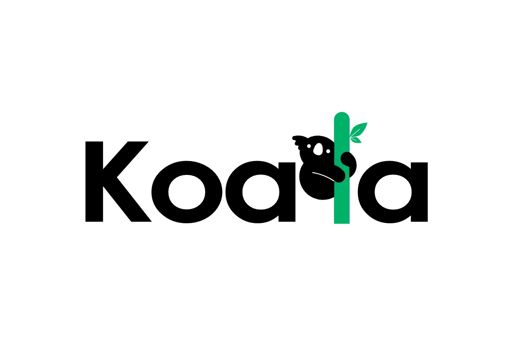

<div align="center">
  

  # Koala.AI

  A Python framework for building AI agents.

  [](https://www.python.org/downloads/)
  [](https://github.com/astral-sh/ruff)
</div>

---

## What Koala is

Koala is a small, typed Python framework for building AI agents. One `Agent`
class, one `Model` wrapper covering ten OpenAI-compatible providers, one
`@tool` decorator that derives its schema from your function signature, and
one event-stream contract that every layer speaks. Streaming, structured
output, multi-agent handoffs, human-in-the-loop approval, and DAG
orchestration are built in.

## Hello agent

```python
from koala import Agent, tool


@tool
def add(a: int, b: int) -> int:
    """Add two integers and return the sum."""
    return a + b


agent = Agent(
    "groq/llama-3.3-70b-versatile",
    instructions="You are a precise assistant. Use tools when helpful.",
    tools=[add],
)
agent.show("What is 7 plus 5?")
```

Set an API key first — either `LLM_API_KEY` (universal) or a
provider-specific one like `GROQ_API_KEY` / `OPENAI_API_KEY`. Local
providers (`ollama`, `lmstudio`) need no key.

## Install

```bash
git clone https://github.com/PR-HARIHARAN/Koala.AI
cd Koala.AI
uv venv                          # or: python -m venv .venv
uv pip install -e ".[dev]"       # or: .venv/Scripts/activate && pip install -e ".[dev]"
```

Requires Python 3.12+. The runtime footprint is two dependencies: `httpx`
and `pydantic`.

## The five things you'll actually use

### 1. `Model` — one class, ten providers

```python
from koala import Model

# provider/name shorthand — resolves base_url + env-var from the built-in registry
m = Model("groq/llama-3.3-70b-versatile")
m = Model("openai/gpt-4o-mini")
m = Model("deepseek/deepseek-chat")
m = Model("ollama/qwen2.5:7b")          # no key needed

# Explicit endpoint (any OpenAI-compatible URL)
m = Model(name="my-model", base_url="http://localhost:8000/v1", api_key="...")
```

Built-in providers: `openai`, `groq`, `deepseek`, `xai`, `together`,
`fireworks`, `openrouter`, `ollama`, `lmstudio`, `custom`. Register more
at runtime with `koala.register_provider(...)`.

Key resolution order: explicit `api_key=` → provider-specific env var →
`LLM_API_KEY` → keyless (Ollama/LM Studio) → `MissingApiKey`.

### 2. `@tool` — a Python function is a tool

```python
from koala import tool


@tool
def get_weather(city: str, units: str = "celsius") -> str:
    """Return the current weather for a city.

    Args:
        city: City name, e.g. "Tokyo".
        units: "celsius" or "fahrenheit".
    """
    return f"18 {units} and clear in {city}"
```

Koala derives the JSON schema from your signature and Google-style
docstring. `RunContext` deps can be injected by adding a parameter typed as
`RunContext`.

### 3. `Agent` — tool loop, structured output, handoffs

```python
from pydantic import BaseModel
from koala import Agent


class Weather(BaseModel):
    city: str
    temp_c: float
    condition: str


agent = Agent(
    "openai/gpt-4o-mini",
    instructions="Reply with structured weather data.",
    tools=[get_weather],
    output_type=Weather,           # validated Pydantic output
    max_iterations=10,
)

result = agent.run("What's the weather in Tokyo?")
print(result.output.temp_c)        # 18.0
print(result.usage.total_tokens)   # cumulative usage across the run
```

### 4. `AgentSession` — streaming + human-in-the-loop

```python
import asyncio
from koala import Agent
from koala.core import AwaitingApproval, Done, ModelDelta
from koala.tools import RequireApprovalFor


agent = Agent(
    "openai/gpt-4o-mini",
    tools=[charge_card],
    approval_rules=[RequireApprovalFor(names=frozenset({"charge_card"}))],
)


async def main() -> None:
    async with agent.session() as s:
        await s.send("Buy me a coffee.")
        async for event in s.events():
            match event:
                case ModelDelta(text=t):
                    print(t, end="", flush=True)
                case AwaitingApproval(call=c, request_id=r):
                    ok = input(f"\nApprove {c.name}? y/n ")
                    await s.reply_approval(r, "allow" if ok == "y" else "deny")
                case Done():
                    break


asyncio.run(main())
```

Approval defaults to deny after `approval_timeout` — the resolver raises
`ResolverTimeoutError` so the deny reason is informative.

### 5. `flow(...)` — DAG orchestration over agents, tools, and callables

```python
from koala import Agent, tool
from koala.orchestration import LocalExecutor, flow


@tool
def word_count(text: str) -> int:
    """Count words."""
    return len(text.split())


researcher = Agent("groq/llama-3.3-70b-versatile", name="researcher")
writer = Agent("groq/llama-3.3-70b-versatile", name="writer")

pipeline = (
    flow("research-and-write")
    .step("research", researcher, input="$input.topic")
    .step("tweet", writer, input="$result.research")
    .step("length", word_count, text="$result.tweet")
    .edge("research", "tweet")
    .edge("tweet", "length")
    .build()
)
print(LocalExecutor().run(pipeline, input={"topic": "koalas"}))
```

Steps can be Agents, Tools, Models, plain callables, or anything that
satisfies the L1 `Runnable` protocol. `$input.<key>` and
`$result.<step_id>` references are substituted at run time. Independent
branches run concurrently.

Deploy the same `Flow` to Airflow with `AirflowExecutor` — it generates a
runnable DAG file that calls back into your Python actions.

## Design

Koala is organized as a stack of layered packages:

```
koala/
  core/            L1 primitives — Message, Event, Runnable, RunContext,
                   Capability, ApprovalRule
  models/          L2 — Model, BaseProvider, UniversalProvider, built-in
                   provider registry, ChatSettings, LLM_API_KEY resolution
  tools/           L3 — @tool, BaseTool, FunctionTool, Pydantic schema
                   derivation, approval rules
  memory/          L4 — BaseMemory, InMemoryMemory, SQLiteMemory
  behaviors/       L5 — Behavior, Persona, ToolPack, ApprovalPolicy,
                   OutputSchema, ModelSettings
  agents/          L6 — Agent, BaseAgent, AgentTool (handoff), RunResult
  orchestration/   L7 — flow(), Flow, Step, LocalExecutor, AirflowExecutor
  harness/         L8 — AgentSession (implements L1 Channel for HITL)
  ui/              show / ashow — print-simple output for any layer
```

Every layer speaks the same event vocabulary from `core`. `Agent`, `Model`,
`Tool`, and `Flow` all satisfy the `Runnable` protocol, so anything that
takes a `Runnable` can compose them uniformly.

## Examples

Four runnable one-file examples in `examples/`:

- `examples/quickstart.py` — Agent + `@tool` + live streaming
- `examples/handoff.py` — coordinator agent delegating to specialists
- `examples/structured_output.py` — Pydantic-validated output
- `examples/flow.py` — multi-step DAG mixing agents and tools

Run any of them with `uv run examples/<name>.py`.

## Development

```bash
uv pip install -e ".[dev]"
.venv/Scripts/python -m pytest tests/ --no-cov
.venv/Scripts/python -m ruff check src/koala tests
.venv/Scripts/python -m mypy src/koala
```

## Status

Pre-1.0. The public API — `Agent`, `Model`, `AgentSession`, `@tool`,
`flow()`, and everything re-exported from `koala.core` — is what will
carry forward. Legacy modules from the pre-refactor codebase are quarantined
under `koala._legacy/` and will be removed in a future release.
